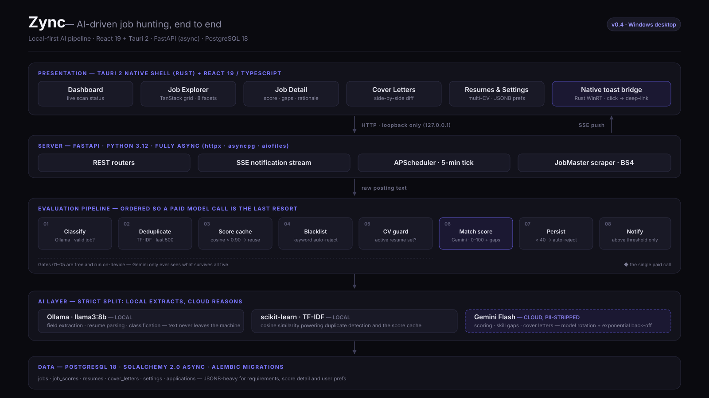

# Zync 🎯

> **Zync** is an AI-driven, hyper-personalized job hunting and application management automation system. It acts as an autonomous agent that scrapes job postings, deeply analyzes them against your CV using local and cloud LLMs, scores the match, and helps you apply with pinpoint accuracy.

## 🚀 Vision
Stop sending generic CVs into the void. Zync scans multiple job platforms, evaluates the exact requirements using AI, scores the match, and natively prepares tailored applications — all from a lightweight, lightning-fast desktop application.

## 🏗️ Architecture at a Glance



The evaluation pipeline is ordered deliberately: gates 01–05 are free and run on-device,
so the one paid model call only ever sees postings that survived all five. Full detail —
schema, endpoints, workflows — lives in [DESIGN.md](DESIGN.md).

## ✨ What Works Today (v0.4)

- **Job ingestion** — paste a URL or raw text, or let the background scraper pull from JobMaster on a schedule you set (1–24 h).
- **Two-tier AI evaluation** — local Ollama extracts structured fields; Gemini scores the match 0–100 with a rationale and a matched/missing skill breakdown.
- **Multi-CV scoring** — score the same job against several CVs. The Explorer shows the active CV's score, or the best across all of them.
- **Job Explorer** — sortable data grid with faceted filters (role, company, score, date range, CV, source, skills, experience), free-text search, and unread / new-in-24h tracking.
- **Cover letters on demand** — your template, tailored per job by Gemini, reviewed in a side-by-side diff before you use it.
- **Background scanning & notifications** — native OS notifications with configurable delivery mode, a do-not-disturb window, and a score threshold. Clicking one opens the app on the matching jobs.
- **Noise control** — keyword blacklist, TF-IDF duplicate detection, and a score cache that avoids paying for the same comparison twice.
- **Native Windows desktop app** — packaged with Tauri as an `.exe` installer.

## 🛠️ Tech Stack
- **Frontend / UI:** React 19 + TypeScript (Vite), packaged as a native desktop app via **Tauri 2** (Rust). TanStack Query for server state, TanStack Table for the Explorer grid, CSS Modules for styling, and a central i18n dictionary (no hardcoded UI strings).
- **Backend:** Python 3.12+ (FastAPI, fully async).
- **Database:** PostgreSQL 18 + `asyncpg` + SQLAlchemy 2.0 (Alembic migrations, JSONB-heavy schema).
- **AI Inference:**
  - **Local:** `Ollama` (`llama3:8b`) for cost-free job parsing, resume extraction, content classification, and application-channel extraction.
  - **Cloud:** `Gemini Flash` API for deep reasoning — match scoring, skill gap analysis, and CV rewriting. Stateful model rotation across a configurable `GEMINI_MODELS` list with exponential back-off and 1-hour cooldown reset.
- **Similarity Engine:** `scikit-learn` TF-IDF cosine similarity for duplicate detection and score caching.
- **Background Scheduler:** `APScheduler` (`AsyncIOScheduler`) — 5-minute tick cadence, live settings re-read on each tick.
- **Scraping:** BeautifulSoup4 (HTML extraction) + `httpx.AsyncClient`; Playwright _(planned)_.
- **Resume Parsing:** `pdfminer.six` (PDF), `python-docx` (DOCX).
- **Date Parsing:** `dateparser` for normalizing relative and locale-aware date strings extracted from job postings.

## 📂 Project Structure
```text
Zync/
├── server/            # Python FastAPI server, AI services, scrapers
│   ├── app/
│   │   ├── api/       # Route handlers and pipeline helpers
│   │   ├── models/    # SQLAlchemy ORM models
│   │   ├── schemas/   # Pydantic request/response schemas
│   │   └── services/  # Business logic (scoring, parsing, caching, etc.)
│   ├── alembic/       # Database migration scripts
│   └── tests/
├── client/            # React + Tauri desktop application
│   ├── src/           # TypeScript / React source
│   └── src-tauri/     # Tauri (Rust) native shell
├── docs/              # Diagrams and other rendered documentation assets
├── .agent_logs/       # Archive of failed approaches, so dead ends aren't re-explored
├── DESIGN.md          # Architecture, database schema, API reference
├── docker-compose.yml # PostgreSQL infrastructure
└── README.md
```

## ⚙️ Getting Started (Development)

### Prerequisites
1. **Node.js** v20+
2. **Python** 3.12+
3. **Rust & Cargo** (required by Tauri — install via [rustup](https://rustup.rs))
4. **Docker Desktop** (running, for PostgreSQL)
5. **Ollama** installed locally with the `llama3:8b` model pulled (`ollama pull llama3:8b`)
6. A **Gemini API key** (required for match scoring — [get one here](https://aistudio.google.com/apikey))

---

### Step 1: Start the Database

```bash
docker compose up -d
```

This starts a PostgreSQL 18 instance on `localhost:5432` with the default credentials in `docker-compose.yml`.

---

### Step 2: Set Up the Server

```bash
cd server
```

**Create a `.env` file** in the `server/` directory with at minimum:
```env
GEMINI_API_KEY=your_gemini_api_key_here
```

All other settings have sensible defaults (see `app/core/config.py`). Override as needed:
```env
# Database (defaults match docker-compose.yml)
DB_HOST=localhost
DB_PORT=5432
DB_USER=zync_user
DB_PASSWORD=zync_password
DB_NAME=zync_db

# Ollama
OLLAMA_BASE_URL=http://localhost:11434
OLLAMA_MODEL=llama3:8b

# Gemini (required for scoring) — comma-separated fallback list
GEMINI_API_KEY=your_gemini_api_key_here
GEMINI_MODELS=gemini-3.5-flash,gemini-3-flash-preview,gemini-3.1-flash-lite

# JobMaster scraper
JOBMASTER_BASE_URL=https://www.jobmaster.co.il
INITIAL_SCAN_LIMIT=3
```

**Install dependencies:**
```bash
pip install -e .
```

**Run database migrations:**
```bash
alembic upgrade head
```

**Start the server:**
```bash
uvicorn app.main:app --reload --host 0.0.0.0 --port 8000
```

The API will be available at `http://localhost:8000`. Interactive docs at `http://localhost:8000/docs`.

---

### Step 3: Set Up the Client

```bash
cd client
npm install
```

**Run in browser (dev mode, no Tauri shell):**
```bash
npm run dev
```

**Run as a native desktop app:**
```bash
npm run tauri dev
```

---

### Step 4: Build the Desktop Installer (optional)

```bash
npm run tauri build
```

Produces an NSIS installer and an MSI under `client/src-tauri/target/release/bundle/`.

The packaged app has no Vite dev proxy, so it calls the backend at the absolute
origin baked in from `client/.env.production` (`VITE_API_BASE=http://127.0.0.1:8000`).
**The backend must already be running** when you launch the installed app — it is
not yet bundled as a sidecar.

---

## 🛡️ Privacy First
Zync processes highly sensitive personal data (resumes, job histories).
- All standard processing runs **locally** via Ollama — parsing, classification, and duplicate detection never touch external servers.
- Only the minimum required payload (job requirements + resume structured data) is sent to the Gemini API for scoring.
- Raw resume text, PII fields, and API keys are never written to logs.
- Your data stays in your local PostgreSQL database.
